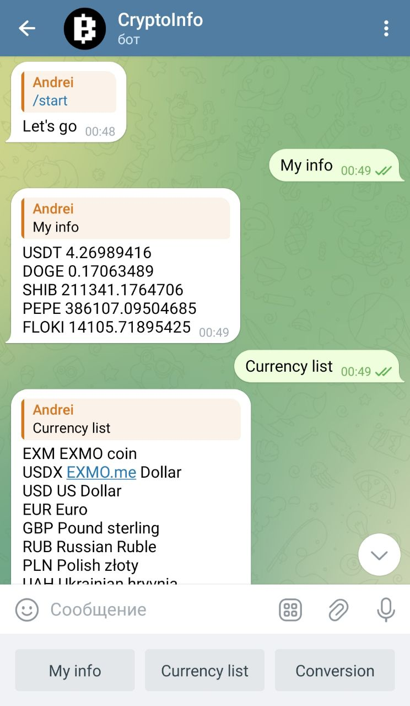
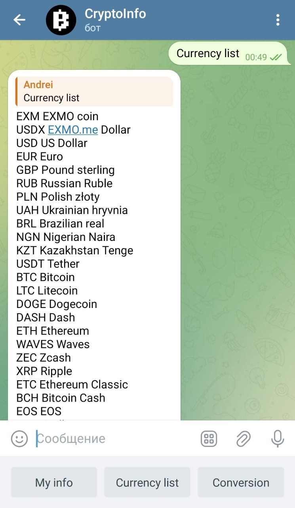
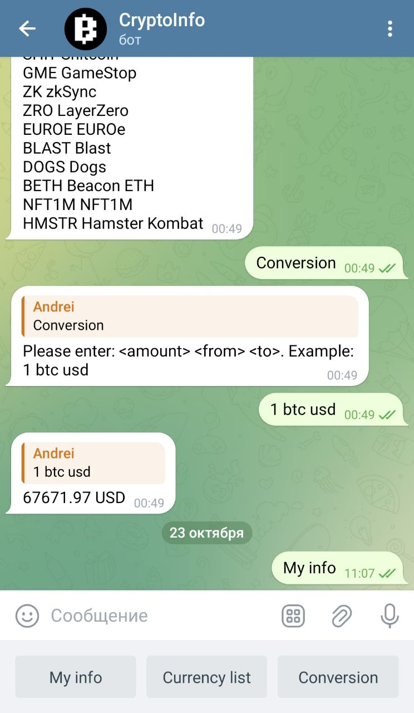

# crypto-info
Crypto info - приложение для получения информации о криптовалютах, а так же получение информации о состоянии моего счета 
на бирже криптовалют.

Технологии:
Микросервисная архитектура, Java 17, Spring Boot, MongoDB,
Gradle, Kafka, Docker, K8s, GraphQL, Quartz, JUnit.

# Краткое описание
С определенной периодичностью quartz job получает данные из API coinmarketcap и сохраняет их в БД. Данные о криптовалютах
из БД можно получить через эндпоинт GraphQL. Когда нужно получить информацию о той или иной валюте TG bot отправляет 
ивент в kafka. Crypto info service подписан на соответствующий топик, читает сообщение из бота обрабатывает его и 
в зависимости от типа отправляет запрос на тот или иной API. API отвечает и сервис в зависимости от типа запроса 
сохраняет необходимые данные в БД и затем отправляет ивент в kafka, который читает tg бот service и отображает данные в чате.
Приложение настроено для разворачивания в кластере. 

# Возможности
- ендпоинты, которые по технологии GraphQL возвращают информацию о криптовалютах;
- конвертер криптовалют - преобразование валют из фиата в криптовалюту и наоборот;
- получение детальной информации об аккаунте клиента.

# Возможности tg bot
- My info - получение детальной информации об аккаунте клиента.
- Currency list - получение всех криптовалют на данной бирже
- Conversion - преобразование криптовалют(обменник)

# GraphQL запросы

- Получение нужной информации о криптовалюте из БД.
query {
    getAllBy(cryptocurrency: "BTC", page: 0, size: 5) {
    cryptocurrency
    price
    volume24h
    dateTime
    }
}

- Добавление криптовалюты в личный портфель для ведения статистики.
mutation {
    addStock(stockPortfolioDto: {
    currency: "btc"
    stockExchange: "Exmo"
    amount: "1"
    })
}

